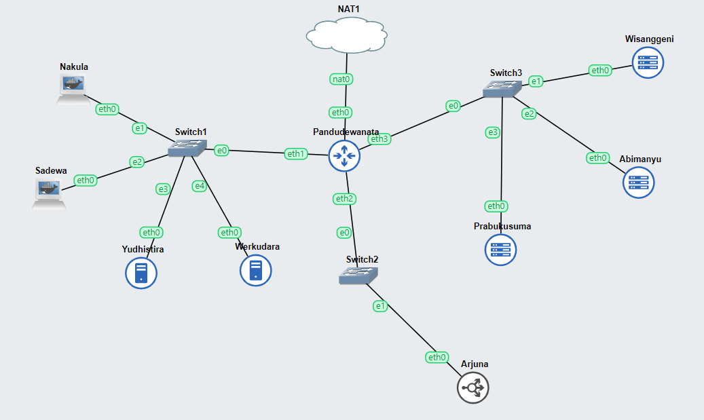

# Praktikum Modul 2 Jaringan Komputer

## Kelompok F01


## Anggota Kelompok

| **NAMA** | **NRP** |
|----------|----------|
| `Alfa Fakhrur Rizal Zaini` | `5025211214` |


## Sections
| Soal  |
|-------|
| Nomor 1|
| Nomor 2|
| Nomor 3|
| Nomor 4|
| Nomor 5|
| Nomor 6|
| Nomor 7|
| Nomor 8|
| Nomor 9|
| Nomor 10|
| Nomor 11|
| Nomor 12|
| Nomor 13|
| Nomor 14|
| Nomor 15|
| Nomor 16|
| Nomor 17|
| Nomor 18|
| Nomor 19|
| Nomor 20|


### Soal Nomor 1
```
Yudhistira akan digunakan sebagai DNS Master, Werkudara sebagai DNS Slave, Arjuna merupakan Load Balancer yang terdiri dari beberapa Web Server yaitu Prabakusuma, Abimanyu, dan Wisanggeni. Buatlah topologi dengan pembagian sebagai berikut. Folder topologi dapat diakses pada drive berikut 
```

Jawaban: 


### Soal Nomor 2
```
Buatlah website utama pada node arjuna dengan akses ke arjuna.yyy.com dengan alias www.arjuna.yyy.com dengan yyy merupakan kode kelompok.
```

Jawaban:

Pertama kita set-up terlebih dahulu untuk dns_master agar mengarah ke arjuna menggunakan konfigurasi pada ``named.conf.local`` dan ``/etc/bind/jarkom/arjuna.f01.com`` lalu ganti nameserver value pada ``/etc/resolv.conf`` menjadi ke yudhistira

**Yudhistira**
```sh
echo '
zone "arjuna.f01.com" {
	type master;
    also-notify { 10.52.1.5; };
    allow-transfer { 10.52.1.5; };
	file "/etc/bind/jarkom/arjuna.f01.com";
};' > /etc/bind/named.conf.local

echo '
;
; BIND data file for local loopback interface
;
$TTL  604800
@   IN      SOA     arjuna.f01.com.  root.arjuna.f01.com. (
                    2023100601      ; Serial
                        604800      ; Refresh
                        86400       ; Retry 
                        2419200     ; Expire
                        604800  )   ; Negative Cache TTL
;
@   IN      NS      arjuna.f01.com.
@   IN      A       10.52.2.2       ;
www IN      CNAME   arjuna.f01.com.
' > /etc/bind/jarkom/arjuna.f01.com
```

**Nakula**
```sh
echo nameserver 10.52.1.4 > /etc/resolv.conf
echo nameserver 10.52.1.5 >> /etc/resolv.conf
```

### Soal Nomor 3
```
Dengan cara yang sama seperti soal nomor 2, buatlah website utama dengan akses ke abimanyu.yyy.com dan alias www.abimanyu.yyy.com.
```

Jawaban:

Sama seperti sebelumnya, sekarang kita perlu melakukan setting pada ``named.conf.local`` dan ``/etc/bind/jarkom/abimanyu.f01.com`` dengan mengarahkan domain ke Abimanyu

**Yudhistira**
```sh
echo '
zone "abimanyu.f01.com" {
	type master;
    also-notify { 10.52.1.5; };
	file "/etc/bind/jarkom/abimanyu.f01.com";
    allow-transfer { 10.52.1.5; };
};' >> /etc/bind/named.conf.local

echo '
;
; BIND data file for local loopback interface
;
$TTL  604800
@   IN      SOA     abimanyu.f01.com.  root.abimanyu.f01.com. (
                    2023100601      ; Serial
                        604800      ; Refresh
                        86400       ; Retry 
                        2419200     ; Expire
                        604800  )   ; Negative Cache TTL
;
@   IN      NS      abimanyu.f01.com.
@   IN      A       10.52.3.3       ;
www IN      CNAME   abimanyu.f01.com.
' > /etc/bind/jarkom/abimanyu.f01.com
```

Dengan pengaturan ini, maka setiap request ke domain abimanyu.f01.com akan diarahkan ke server abimanyu (10.56.3.3)

### Soal Nomor 4
```
Kemudian, karena terdapat beberapa web yang harus di-deploy, buatlah subdomain parikesit.abimanyu.yyy.com yang diatur DNS-nya di Yudhistira dan mengarah ke Abimanyu.
```

Jawaban:

Kita sekarang perlu menambahkan 1 buah line yakni A record untuk parikesit pada ``/etc/bind/jarkom/abimanyu.f01.com``

**Yudhistira**
```sh
echo '
www.parikesit IN      CNAME   parikesit.abimanyu.f01.com.
parikesit   IN  A   10.52.3.3
' >> /etc/bind/jarkom/abimanyu.f01.com
```

Dengan pengaturan tersebut, setiap request ke ``parikesit.abimanyu.f01.com`` akan diarahkan ke server abimanyu

### Soal Nomor 5
```
Buat juga reverse domain untuk domain utama. (Abimanyu saja yang direverse)
```

Jawaban:

Kita perlu membaut zone reverse untuk domain abimanyu.f01.com pada ``named.conf.local`` dan ``/etc/bind/jarkom/1.52.10.in-addr.arpa``

**Yudhistira**
```sh
echo '
zone "1.52.10.in-addr.arpa" {
	type master;
	file "/etc/bind/jarkom/1.52.10.in-addr.arpa";
};' >> /etc/bind/named.conf.local

echo '
;
; BIND data file for local loopback interface
;
$TTL  604800
@   IN      SOA     abimanyu.f01.com.  root.abimanyu.f01.com. (
                    2023100603      ; Serial
                        604800      ; Refresh
                        86400       ; Retry 
                        2419200     ; Expire
                        604800  )   ; Negative Cache TTL
;
1.52.10.in-addr.arpa.    IN  NS  abimanyu.f01.com.
4   IN  PTR    abimanyu.f01.com.
' > /etc/bind/jarkom/1.52.10.in-addr.arpa
```

### Soal Nomor 6
```
Agar dapat tetap dihubungi ketika DNS Server Yudhistira bermasalah, buat juga Werkudara sebagai DNS Slave untuk domain utama.
```
Jawaban:


Untuk menyelesaikan permasalahan ini, kita perlu menjadi server wekudara menjadi slave untuk domain utama (abimanyu dan arjuna), dimana kita set masternya sebagai yudhistira.

**Werkudara**
```sh
echo '
zone "abimanyu.f01.com" {
    type slave;
    masters { 10.52.1.4; };
    file "/var/lib/bind/abimanyu.f01.com";
};

zone "arjuna.f01.com" {
    type slave;
    masters { 10.52.1.4; };
    file "/var/lib/bind/arjuna.f01.com";
};' >> /etc/bind/named.conf.local
```

Pengujian bsia dilakukan dengan mematikan dns master dan melakukan ping ke domain, apabila ada response, maka dns slave sudah berjalan dengan baik.

### Soal Nomor 7
```
Seperti yang kita tahu karena banyak sekali informasi yang harus diterima, buatlah subdomain khusus untuk perang yaitu baratayuda.abimanyu.yyy.com dengan alias www.baratayuda.abimanyu.yyy.com yang didelegasikan dari Yudhistira ke Werkudara dengan IP menuju ke Abimanyu dalam folder Baratayuda.
```

Jawaban:

Pada soal ini, kita diberikan kasus untuk memberikan delegasi (wewenang) pada dns slave untuk mengatur domain ``baratayuda.abimanyu.f01.com``, hal ini bisa kita capai dengan membuat nameserver record pada dns master dan mengatur zone untuk domain tersebut pada dns slave.

**Yudistira**
```sh
echo '
ns1 IN      A       10.52.1.5
baratayuda  NS      ns1
' > /etc/bind/jarkom/abimanyu.f01.com

echo 'options{
        directory "/var/cache/bind";
        
        // dnssec-validation auto;
        allow-query{any;};
        auth-nxdomain no;
        listen-on-v6{ any; };
};' > /etc/bind/named.conf.options
```

**Werkudara**
```sh
echo '
;
; BIND data file for local loopback interface
;
$TTL  604800
@   IN      SOA     baratayuda.abimanyu.f01.com.  root.baratayuda.abimanyu.f01.com. (
                    2023100601      ; Serial
                        604800      ; Refresh
                        86400       ; Retry 
                        2419200     ; Expire
                        604800  )   ; Negative Cache TTL
;
@   IN      NS      baratayuda.abimanyu.f01.com.
@   IN      A       10.52.3.3       ;
www IN      CNAME   baratayuda.abimanyu.f01.com.' > /etc/bind/Baratayuda/baratayuda.abimanyu.f01.com

echo 'options{
        directory "/var/cache/bind";
        
        // dnssec-validation auto;
        allow-query{any;};
        auth-nxdomain no;
        listen-on-v6{ any; };
};' > /etc/bind/named.conf.options
```

Untuk pengujian, kita matikan dns master lalu lakukan ping ke domain ``baratayuda.abimanyu.f01.com``, apabila ada response, maka delegasi dns slave sudah berjalan dengan baik.

### Soal Nomor 8
```
Untuk informasi yang lebih spesifik mengenai Ranjapan Baratayuda, buatlah subdomain melalui Werkudara dengan akses rjp.baratayuda.abimanyu.yyy.com dengan alias www.rjp.baratayuda.abimanyu.yyy.com yang mengarah ke Abimanyu.
```

Jawaban:

Untuk menyelesaikan problem ini, kita perlu membuat A record pada dns slave untuk domain ``rjp.baratayuda.abimanyu.f01.com``

**Werudara**
```sh
echo 'rjp IN      A       10.52.3.3       ;
www.rjp IN      CNAME   rjp.baratayuda.abimanyu.f01.com.' >> /etc/bind/Baratayuda/baratayuda.abimanyu.f01.com
```

### Soal Nomor 9
```
Arjuna merupakan suatu Load Balancer Nginx dengan tiga worker (yang juga menggunakan nginx sebagai webserver) yaitu Prabakusuma, Abimanyu, dan Wisanggeni. Lakukan deployment pada masing-masing worker.
```

Jawaban:
Kita perlu membuat settingan di nginx pada arjuan yang bekerja sebagai load balancer, dimana kita perlu membuat 3 upstream yang mengarah ke 3 server yang berbeda. dan melakukan deployment pada 3 server tersebut.

**Arjuna**
```sh
echo '
upstream worker {
        server 10.52.3.2;
        server 10.52.3.3;
        server 10.52.3.4;
}

server {
    listen 80;
    
    server_name arjuna.f01.com www.arjuna.f01.com;

    location / {
        proxy_pass http://worker;
    }
}' > /etc/nginx/sites-available/arjuna.f01.com

ln -s /etc/nginx/sites-available/arjuna.f01.com /etc/nginx/sites-enabled/
```

**Wisanggeni**
```sh
echo '
<!DOCTYPE html>
<html lang="en">
<head>
    <meta charset="UTF-8">
    <meta name="viewport" content="width=device-width, initial-scale=1.0">
    <title>wisanggeni</title>
</head>
<body>
    Hello from wisanggeni
</body>
</html>
' > /var/www/html/index.html
echo '
server {
    listen 80;
    root /var/www/html/;
    index index.html index.htm;  # Remove index.php from here
    server_name _;

    location / {
        try_files $uri $uri/ =404;  # Adjust the try_files directive as needed
    }

    error_log /var/log/nginx/wisanggeni_error.log;
    access_log /var/log/nginx/wisanggeni_access.log;
}
 ' > /etc/nginx/sites-available/wisanggeni.f01.com

 ln -s /etc/nginx/sites-available/wisanggeni.f01.com /etc/nginx/sites-enabled
```
**Prabukusuma**
```sh
echo '
<!DOCTYPE html>
<html lang="en">
<head>
    <meta charset="UTF-8">
    <meta name="viewport" content="width=device-width, initial-scale=1.0">
    <title>prabukusuma</title>
</head>
<body>
    Hello from prabukusuma
</body>
</html>
' > /var/www/html/index.html

echo '
server {
    listen 80;
    root /var/www/html/;
    index index.html index.htm;
    server_name _;

    location / {
        try_files $uri $uri/ =404;
    }

    error_log /var/log/nginx/prabukusuma_error.log;
    access_log /var/log/nginx/prabukusuma_access.log;
}
 ' > /etc/nginx/sites-available/prabukusuma.f01.com

 ln -s /etc/nginx/sites-available/prabukusuma.f01.com /etc/nginx/sites-enabled
```

**Abimanyu**
```sh
echo '
server {
    listen 80;
    root /var/www/html/;
    index index.php index.html index.htm;
    server_name _;

    location / {
        try_files $uri $uri/ =404;
    }

    error_log /var/log/nginx/abimanyu_error.log;
    access_log /var/log/nginx/abimanyu_access.log;
}
 ' > /etc/nginx/sites-available/abimanyu.f01.com

ln -s /etc/nginx/sites-available/abimanyu.f01.com /etc/nginx/sites-enabled

echo '
<!DOCTYPE html>
<html lang="en">
<head>
    <meta charset="UTF-8">
    <meta name="viewport" content="width=device-width, initial-scale=1.0">
    <title>Your Flag</title>
</head>
<body>
    jarkom2023{n3v3r_sh4r3_y0ur_s3cr3tssss}
</body>
</html>
' > /var/www/html/
```


Pengujian bisa dilakukan dengan mengakses masing-masing ip pada port 80, apabila response yang diberikan sesuai dengan page yang ada pada directory, maka pengaturan yang telah dibuat sudah benar.

### Soal Nomor 10
```
Kemudian gunakan algoritma Round Robin untuk Load Balancer pada Arjuna. Gunakan server_name pada soal nomor 1. Untuk melakukan pengecekan akses alamat web tersebut kemudian pastikan worker yang digunakan untuk menangani permintaan akan berganti ganti secara acak. Untuk webserver di masing-masing worker wajib berjalan di port 8001-8003. Contoh:
    - Prabakusuma:8001
    - Abimanyu:8002
    - Wisanggeni:8003
```

Jawaban:

Pada kasus ini kita hanya perlu mengganti server pada blok upstream arjuna menggunakan port yang berbeda dengan contoh pada soal, dan mengganti pengaturan nginx pada masing masing server untuk melisten pada poert yang sesuai.

**Arjuna**
```sh
echo '
upstream worker {
        server 10.52.3.2:8001;
        server 10.52.3.3:8002;
        server 10.52.3.4:8003;
}

server {
    listen 80;
    
    server_name arjuna.f01.com www.arjuna.f01.com;

    location / {
        proxy_pass http://worker;
    }
}' > /etc/nginx/sites-available/arjuna.f01.com

ln -s /etc/nginx/sites-available/arjuna.f01.com /etc/nginx/sites-enabled

service nginx restart
```

**Wisanngeni**
```sh
echo '
<!DOCTYPE html>
<html lang="en">
<head>
    <meta charset="UTF-8">
    <meta name="viewport" content="width=device-width, initial-scale=1.0">
    <title>wisanggeni</title>
</head>
<body>
    Hello from wisanggeni
</body>
</html>
' > /var/www/html/index.html

echo '
server {
    listen 8003;
    root /var/www/html/;
    index index.html index.htm;  # Remove index.php from here
    server_name _;

    location / {
        try_files $uri $uri/ =404;  # Adjust the try_files directive as needed
    }

    error_log /var/log/nginx/wisanggeni_error.log;
    access_log /var/log/nginx/wisanggeni_access.log;
}
 ' > /etc/nginx/sites-available/wisanggeni.f01.com

 ln -s /etc/nginx/sites-available/wisanggeni.f01.com /etc/nginx/sites-enabled
 
 service nginx restart
```
**Abimanyu**
```sh
echo '
server {
    listen 8002;
    root /var/www/html/;
    index index.php index.html index.htm;
    server_name _;

    location / {
        try_files $uri $uri/ =404;
    }

    error_log /var/log/nginx/abimanyu_error.log;
    access_log /var/log/nginx/abimanyu_access.log;
}
 ' > /etc/nginx/sites-available/abimanyu.f01.com

ln -s /etc/nginx/sites-available/abimanyu.f01.com /etc/nginx/sites-enabled

echo '
<!DOCTYPE html>
<html lang="en">
<head>
    <meta charset="UTF-8">
    <meta name="viewport" content="width=device-width, initial-scale=1.0">
    <title>Your Flag</title>
</head>
<body>
    jarkom2023{n3v3r_sh4r3_y0ur_s3cr3tssss}
</body>
</html>
' > /var/www/html/
```
**Prabukusuma**
```sh
echo '
<!DOCTYPE html>
<html lang="en">
<head>
    <meta charset="UTF-8">
    <meta name="viewport" content="width=device-width, initial-scale=1.0">
    <title>prabukusuma</title>
</head>
<body>
    Hello from prabukusuma
</body>
</html>
' > /var/www/html/index.html

echo '
server {
    listen 8001;
    root /var/www/html/;
    index index.html index.htm;
    server_name _;

    location / {
        try_files $uri $uri/ =404;
    }

    error_log /var/log/nginx/prabukusuma_error.log;
    access_log /var/log/nginx/prabukusuma_access.log;
}
 ' > /etc/nginx/sites-available/prabukusuma.f01.com

 ln -s /etc/nginx/sites-available/prabukusuma.f01.com /etc/nginx/sites-enabled
```

Penggunaan Round Robin untuk load balacning adalah membagi beban berdasarkan jumlah server yang ada, dimana setiap request akan diarahkan ke server yang berbeda secara bergantian. Untuk pengujian bisa dilakukan dengan mengakses domain ``arjuna.f01.com`` pada port 80, dan melakukan refresh beberapa kali, apabila server yang meresponse berubah ubah, maka pengaturan sudah benar.

### Soal Nomor 11
```
Selain menggunakan Nginx, lakukan konfigurasi Apache Web Server pada worker Abimanyu dengan web server www.abimanyu.yyy.com. Pertama dibutuhkan web server dengan DocumentRoot pada /var/www/abimanyu.yyy
```

Jawaban:

Untuk menyelesaikan soal tersebut, kita perlu menginstall apache pada server abimanyu, dan mengatur directory root pada apache agar mengarah ke ``/var/www/abimanyu.f01.com`` lalu menbuat konfigurasi apache conf nya.

**Abimanyu**
```sh
apt-get install apache2 -y
apt-get install php php-fpm -y
apt-get install libapache2-mod-php7.0 -y
apt-get install unzip -y

wget 'https://drive.usercontent.google.com/download?id=1a4V23hwK9S7hQEDEcv9FL14UkkrHc-Zc&export=download&authuser=0&confirm=t&uuid=ba803a01-09da-443a-aca9-f9af1f05407a&at=APZUnTW3k1liYo8m6AXA1QNDCNX1:1696931215102' -O abimanyu.zip

unzip -o abimanyu.zip

mv abimanyu.yyy.com/* /var/www/abimanyu.f01/
echo '
<VirtualHost *:80>
    ServerAdmin webmaster@abimanyu.f01.com
    ServerName abimanyu.f01.com
    ServerAlias www.abimanyu.f01.com
    DocumentRoot /var/www/abimanyu.f01/
    <Directory /var/www/abimanyu.f01/>
        Options +Indexes
        AllowOverride All
    </Directory>
    DirectoryIndex index.php index.html
    ErrorLog ${APACHE_LOG_DIR}/abimanyu_error.log
    CustomLog ${APACHE_LOG_DIR}/abimanyu_access.log combined
</VirtualHost>
' > etc/apache2/sites-available/abimanyu.f01.conf

a2ensite abimanyu.f01.conf
```

Pengujian bisa dilakukand engan mengakses domain abimanyu.f01.com pada port 80, apabila response yang diberikan sesuai dengan page yang ada pada directory, maka pengaturan yang telah dibuat sudah benar. 

### Soal Nomor 12
```
Setelah itu ubahlah agar url www.abimanyu.yyy.com/index.php/home menjadi www.abimanyu.yyy.com/home.
```

Jawaban:

Kita perlu membuat sebuah .htaccess file pada directory root agar mengarahkan request ke ``/home``.
berikut adalah konfigurasi .htaccess yang digunakan:

**Abimanyu**
```sh
echo '
RewriteEngine On
RewriteBase /

RewriteCond %{REQUEST_FILENAME} !-f
RewriteCond %{REQUEST_FILENAME} !-d
RewriteRule ^index\.php/(.*)$ /$1 [L,R=301]
' > /var/www/abimanyu.f01/.htaccess
```

Pastikan bahwa module rewrite sudah diadd di server dengan menggunakan 
```sh
a2enmod rewrite
```

Lalu restart service dari apache2

### Soal Nomor 13 14 15 16
**13**
```
Selain itu, pada subdomain www.parikesit.abimanyu.yyy.com, DocumentRoot disimpan pada /var/www/parikesit.abimanyu.yyy
```
**14**
```
Pada subdomain tersebut folder /public hanya dapat melakukan directory listing sedangkan pada folder /secret tidak dapat diakses (403 Forbidden).
```
**15**
```
Buatlah kustomisasi halaman error pada folder /error untuk mengganti error kode pada Apache. Error kode yang perlu diganti adalah 404 Not Found dan 403 Forbidden.
```
**16**
```
Buatlah suatu konfigurasi virtual host agar file asset www.parikesit.abimanyu.yyy.com/public/js menjadi 
www.parikesit.abimanyu.yyy.com/js
```

Kita perlu membaut sebuah konfigurasi nginx yang memenuhi kriteria 4 nomor diatas, beriku adalah konfigurasi apache2 yang digunakan:

**Abimanyu**
```sh

wget 'https://drive.usercontent.google.com/download?id=1LdbYntiYVF_NVNgJis1GLCLPEGyIOreS&export=download&authuser=0&confirm=t&uuid=7440274a-d695-44db-8cd9-70df5bbf7c96&at=APZUnTWw6S5Rd4s_a6CHfvUKTqQG:1696947964978' -O parikesit_abimanyu.zip

unzip -o parikesit_abimanyu.zip
mkdir /var/www/parikesit.abimanyu.f01/
cp -r parikesit.abimanyu.yyy.com/* /var/www/parikesit.abimanyu.f01/

echo '
<!DOCTYPE html>
<html lang="en">
<head>
    <meta charset="UTF-8">
    <meta name="viewport" content="width=device-width, initial-scale=1.0">
    <title>Your Flag</title>
</head>
<body>
    jarkom2023{n3v3r_sh4r3_y0ur_s3cr3tssss}
</body>
</html>
' > /var/www/parikesit.abimanyu.f01/secret/flag.html

echo '
<VirtualHost *:80>
    ServerAdmin webmaster@parikesit.abimanyu.f01.com
    ServerName parikesit.abimanyu.f01.com
    ServerAlias www.parikesit.abimanyu.f01.com
    DocumentRoot /var/www/parikesit.abimanyu.f01
    Alias "/js" "/var/www/parikesit.abimanyu.f01/public/js"
    <Directory /var/www/parikesit.abimanyu.f01>
        Options +Indexes +FollowSymLinks -Multiviews
        AllowOverride All 
    </Directory>
    <Directory /var/www/parikesit.abimanyu.f01/public/>
        Options +Indexes
        AllowOverride All
    </Directory>
    <Directory /var/www/parikesit.abimanyu.f01/secret/>
        Options -Indexes
        AllowOverride Limit
        Require all denied
    </Directory>
    ErrorLog ${APACHE_LOG_DIR}/parikesit_error.log
    CustomLog ${APACHE_LOG_DIR}/parikesit_access.log combined
</VirtualHost>
' > etc/apache2/sites-available/parikesit.abimanyu.f01.conf

echo '
Deny from all
' > /var/www/parikesit.abimanyu.f01/secret/.htaccess

echo '
ErrorDocument 403 /error/403.html
ErrorDocument 404 /error/404.html
' > /var/www/parikesit.abimanyu.f01/.htaccess
```

Denagn konfigurasi tersebut, kita tidak akan bisa mengakses semua yang ada apada directory ``/secret`` pada web. Bisa melakukan listing pada public dan root directory. Error code 403 dan 404 menggunakan modifikasi pada file pada directory /error. Dan asset pada directory /public/js bisa diakses melalui url ``/js``

### Soal Nomor 17 18
**17**
```
Agar aman, buatlah konfigurasi agar www.rjp.baratayuda.abimanyu.yyy.com hanya dapat diakses melalui port 14000 dan 14400.
```
**18**
```
Untuk mengaksesnya buatlah autentikasi username berupa “Wayang” dan password “baratayudayyy” dengan yyy merupakan kode kelompok. Letakkan DocumentRoot pada /var/www/rjp.baratayuda.abimanyu.yyy.
```

Jawaban:

Kita perlu membuat sebuah konfigurasi pada apache atau nginx dimana website rjp.abimanyu.f01.com hanya dapat diakses pada port 14400 dan 14000, dan perlu diakses menggunakan autentikasi username ``Wayang`` dan password ``baratayudaf01``

**Abimanyu**
```sh
wget 'https://drive.usercontent.google.com/download?id=1pPSP7yIR05JhSFG67RVzgkb-VcW9vQO6&export=download&authuser=0&confirm=t&uuid=c039943d-843b-47b9-8910-4b46edf58596&at=APZUnTWSNiEJdlQx1mlaCEI-F6-B:1696957565777' -O rjp_baratayuda.zip

unzip -o rjp_baratayuda.zip

mkdir /var/www/rjp.baratayuda.abimanyu.f01/
cp -r rjp.baratayuda.abimanyu.yyy.com/* /var/www/rjp.baratayuda.abimanyu.f01/

echo '
server {
    listen 14000;
    server_name www.rjp.baratayuda.abimanyu.f01.com;

    root /var/www/rjp.baratayuda.abimanyu.f01;
    #index index.php index.html index.htm;

    location / {
        autoindex on;
        autoindex_exact_size on;
        auth_basic "Area Tertutup";
        auth_basic_user_file /etc/nginx/.htpasswd;
    }
    error_log /var/log/nginx/rjp_error.log;
    access_log /var/log/nginx/rjp_access.log;
}

server {
    listen 14400;
    server_name www.rjp.baratayuda.abimanyu.f01.com;

    root /var/www/rjp.baratayuda.abimanyu.f01/;
    #index index.php index.html index.htm;

    location / {
        autoindex on;
        autoindex_exact_size on;
        auth_basic "Area tertutup";
        auth_basic_user_file /etc/nginx/.htpasswd;
    }

    error_log /var/log/nginx/rjp_error.log;
    access_log /var/log/nginx/rjp_access.log;
}

' > etc/nginx/sites-available/rjp.baratayuda.abimanyu.f01.com

ln -s /etc/nginx/sites-available/rjp.baratayuda.abimanyu.f01.com /etc/nginx/sites-enabled

chown -R www-data:www-data /var/www/rjp.baratayuda.abimanyu.f01/
htpasswd -c /etc/nginx/.htpasswd Wayang
```

Konfigurasi diatas adalah konfigurasi nginx yang digunakan untuk menyelesaikan soal nomor 17 dan 18, dimana kita perlu membuat 2 server yang berbeda, dimana masing masing server akan meresponse pada port 14000 dan 14400, dan perlu menggunakan autentikasi username ``Wayang`` dan password ``baratayudaf01``. Pada saat membuat autentikasi baru, kita perlu memasukkan password ``baratayudaf01`` dan mengkonfirmasi password tersebut. Setelah selesai, kita perlu merestart service nginx. Apabila kita salah memasukkan atau user password maka akan mengeluarkan error 403 Forbidden. Chown beruna untuk memastikan bahwa bisa diakses oleh www-data.


### Nomor 19
```
Buatlah agar setiap kali mengakses IP dari Abimanyu akan secara otomatis dialihkan ke www.abimanyu.yyy.com (alias)
```

Jawaban:

Kita perlu membuat sebuah konfigurasi apache2 dimana ketika user mengakses ip dari abimanyu, maka akan diarahkan ke domain ``www.abimanyu.f01.com``


**Abimanyu**
```sh
echo '
<VirtualHost *:80>
    ServerName _
    ServerAlias _

    Redirect 301 / http://www.abimanyu.f01.com/
</VirtualHost>
' > /etc/apache2/sites-available/default_abimanyu.conf

a2ensite default_abimanyu.conf
```
Ketika user mencoba mengakses ip dari abimanyu maka akan diredirect 301 ke ``www.abimanyu.f01.com``

### Nomor 20
```
Karena website www.parikesit.abimanyu.yyy.com semakin banyak pengunjung dan banyak gambar gambar random, maka ubahlah request gambar yang memiliki substring “abimanyu” akan diarahkan menuju abimanyu.png.
```


Jawaban:


Kita perlu membuat htaccess dimana ketika client mengakses ``www.parikesit.abimanyu.f01.com`` dan terdapat substring abimanyu.png pada request uri, maka akan diarahkan ke directory ``/public/images/abimanyu.png``.

**Abimanyu**
```sh
echo '
RewriteEngine On
RewriteCond %{REQUEST_URI} !^/public/images/abimanyu.png
RewriteCond %{REQUEST_URI} abimanyu
RewriteRule \.(jpg|jpeg|png)$ /public/images/abimanyu.png [L]
' > /var/www/parikesit.abimanyu.f01/.htaccess

service apache2 restart
```

Jangan lupa untuk merestart apache2, setelah itu coba untuk memasukkan pada request uri seperti ``/notabimanyu.png`` atau ``/abimanyu.png`` atau ``/sonabimanyu.png``. Apabila diredirect ke ``/public/images/abimanyu.png`` maka konfigurasi sudah benar.